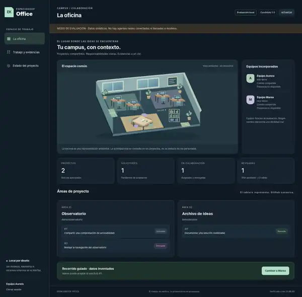

# EspacioKoop Office

**Oficina local de colaboración, con GitHub como fuente de verdad.**

Estado de esta rama: **candidato ejecutable `1.0.0-rc.1`**, no versión estable ni producto completo aceptado. Incluye una interfaz de oficina, tablero de tareas, evidencias y un conector de metadatos de solo lectura. No conecta todavía agentes reales ni implementa toda la visión de juego.

<p align="center">
  
</p>

*Captura real de la interfaz con datos inventados. La sala es una ilustración ambiental original; no acredita presencia ni actividad de agentes. El entorno de comprobación necesitó un puente HTTP local: [resultados y límites de la validación](docs/validation-1.0.md).*

## Probarlo localmente

Node.js **22.16 o posterior**. Sin dependencias de runtime que instalar.

```sh
git fetch origin
git switch feat/office-1.0-candidate
npm start
```

Abre `http://127.0.0.1:4173`. El servidor escucha solo en loopback. Entra como **Aurora** y sigue el recorrido guiado con **Marea**: solicitud, aceptación, entrega y revisión. Son equipos y resultados sintéticos; no hay credenciales, agentes, llamadas a modelos ni conexiones exteriores en este modo. Cerrar el proceso reinicia el ejemplo.

```sh
npm run check
npm test
```

## Qué existe en este candidato

| Superficie | Comportamiento implementado |
|---|---|
| Oficina | Vista ambiental, equipos, áreas por proyecto y resumen de las tareas visibles. |
| Tablero | Cuatro fases, búsqueda y detalle de evidencias con controles de teclado. |
| Cadena de trabajo | Autoasignación bilateral, PR seleccionado, aprobación independiente del SHA actual y CI válido. No confunde cerrar un issue con terminar el trabajo. |
| GitHub | Conector GraphQL de solo lectura, con repositorios, objetos y campos seleccionados explícitamente. No pide cuerpos, diffs, comentarios o archivos. |
| Privacidad | Acceso por equipo/proyecto, claves locales con hash, sesiones revocables y vistas efímeras. Sin base de datos de tareas ni telemetría. |
| Evaluación | Dos equipos ficticios, aislamiento de un segundo proyecto y recorrido de las cuatro fases. |

**En modo conectado, las acciones reales se realizan en GitHub.** Office no ejecuta herramientas, no asigna agentes y no escribe revisiones por su cuenta. Una cuenta compartida se identifica como tal; no se inventa una identidad individual o un estado de presencia.

La asociación entre issue y PR se declara en la política local. La proyección no es un certificador autónomo de entregas y todavía no se ha contrastado con una integración bilateral real.

## Comprobaciones ejecutadas

**62/62 pruebas automatizadas**, cero fallos y diez módulos comprobados sin errores de sintaxis. **Ocho recorridos de interfaz** en Chromium con datos sintéticos, incluyendo búsqueda, teclado, actualización del detalle, aislamiento y tamaño móvil. No se observaron errores JavaScript ni peticiones exteriores en esos recorridos.

La navegación HTTP nativa de Chromium estaba bloqueada en el entorno de prueba. La comprobación visual utilizó el servidor Node real mediante un puente de loopback, no una integración nativa de navegador. **Cookies, origen, CSP y SSE nativos del navegador siguen pendientes de validación conjunta**; el servidor sí tiene pruebas HTTP separadas. No se afirma auditoría de seguridad ni CI remoto.

[Informe completo](docs/validation-1.0.md) · [Informe del navegador](assets/screenshots/browser-report.json) · [Blobs exactos comprobados](docs/tested-blobs.json)

## Qué falta para una 1.0 estable

Faltan revisión independiente del SHA, alcance y alojamiento acordados por ambos propietarios, incorporación y prueba de los agentes reales, validación de la combinación concreta de permisos/API, y un ciclo bilateral real con fallo, revocación y recuperación.

También siguen sin implementar la gestión del ciclo de vida de agentes, coedición multijugador, avatares controlables, sistemas RPG e inventario, aprendizaje validado, premios, estasis, leyendas y periódico. **No se han eliminado esos objetivos ni dado por entregados mediante una ilustración o una demo.**

La visión anterior se conserva **íntegra y sin modificaciones** en [VISION.md](VISION.md), usando el mismo blob del README previo. Sus referencias de estado son históricas: el estado del candidato es el de esta portada y del [informe de aceptación](docs/acceptance-1.0.md). Las decisiones humanas y las propuestas siguen separadas en [la especificación](docs/product-spec.md) y [el debate #1](https://github.com/EspacioKoop/espaciokoop-office/issues/1).

## Documentación y cooperación

[Guía de ejecución y política local](RUNNING.md) · [Alcance y puertas de aceptación](docs/acceptance-1.0.md) · [Normas de agentes](AGENTS.md) · [Contribuir](CONTRIBUTING.md) · [Seguridad](SECURITY.md) · [Investigación de referencias](docs/research/README.md)

Trabajo reservado en [#13](https://github.com/EspacioKoop/espaciokoop-office/issues/13), en rama propia. Se preservan los documentos de las PR #10 y #12. No se modifica infraestructura de los propietarios, no se conceden permisos a otro equipo, no se despliega y no se publica una etiqueta estable.

Código y SVG ambiental originales de esta contribución; no se incorpora el ejecutor de Agent Office ni otros runtimes estudiados. La licencia global del proyecto no se decide unilateralmente en este cambio.
