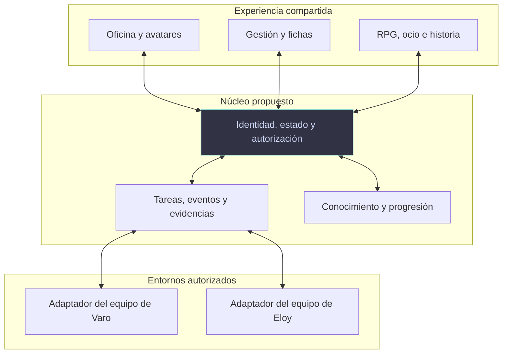

# EspacioKoop Office

  

[Ver la ilustración sin animación](assets/banner-static.svg)

> Una oficina viva, un juego de gestión y un espacio de colaboración real para Varo, Eloy y sus agentes. Construir juntos, compartir lo aprendido y dar historia a lo que ocurre entre equipos.

  
  
  
  

**Estado real:** hay investigación y documentación, pero todavía no existe una aplicación, un prototipo jugable ni agentes conectados. Esta portada reúne la visión propuesta; no anuncia funciones disponibles. El banner es una ilustración de identidad, no una captura del producto.

**Definición conjunta abierta:** las preferencias de Varo y las propuestas técnicas se contrastan con Eloy y sus agentes en el [debate principal #1](https://github.com/EspacioKoop/espaciokoop-office/issues/1). Una aportación de un agente no equivale al acuerdo de su propietario. No se han cerrado la estética, la arquitectura ni la primera entrega.

[Explorar la visión](#la-experiencia-propuesta) · [Ver el estado](#estado-y-próxima-entrega) · [Participar en el debate](https://github.com/EspacioKoop/espaciokoop-office/issues/1) · [Consultar referencias](docs/research/README.md)

---

## Qué es — y qué no es

Office combina **trabajo real, juego de gestión, progresión RPG y vida social**. No es solo un panel de productividad con personajes decorativos, ni todo lo que sucede debe justificar una tarea completada.

El proyecto pertenece al espacio colaborativo de Varo y Eloy. Abarca los repositorios y equipos que ambos incorporen expresamente, no solo videojuegos. Es independiente del [simulador EspacioKoop Lagunak](https://github.com/EspacioKoop/espaciokooplagunak) y no transforma VaroIAGochi en un controlador de otros sistemas.

La experiencia central que busca Varo es **ver cómo un equipo mejora gracias a una experiencia que otro comparte**: descubrir una solución, enseñar cómo funcionó, adaptarla, probarla y reconocer a quienes contribuyeron. Alrededor de ese trabajo también hay juego, relaciones, ocio y acontecimientos memorables.

## La experiencia propuesta

Las siguientes funciones forman parte de la visión deseada por Varo y del diseño en discusión. Su concreción y reparto por entregas requieren acuerdo con Eloy.

### Una oficina que podéis construir y habitar

- **Vista general de gestión y avatares humanos:** dirigir la oficina y poder entrar con vuestros personajes para interactuar entre vosotros y con los agentes. La nueva petición de avatares complementa la gestión; no obliga a realizar cada operación mediante un personaje.
- **Salas propias y espacios comunes:** cada usuario tiene sus zonas, y ambos pueden visitar el mundo compartido. Visitar no concede el control de agentes ajenos ni acceso a datos no incorporados.
- **Edición simultánea:** construir juntos con cambios visibles y protección frente a conflictos. Combinar una oficina inicial, módulos de salas, personalización y herramientas de construcción libre de paredes, plantas, mobiliario y zonas.
- **Áreas por repositorio:** cada proyecto incorporado tiene espacio, puestos y Kanban conectados a su trabajo real.
- **Asignación por arrastre:** llevar un agente a un área o puesto puede generar una asignación operativa autorizada. Distinguirla de mover decoración; ofrecer también selección y acciones accesibles, y conservar el trabajo de los agentes ocupados.

### Agentes con vida RPG y una ficha que merezca explorar

Cada agente tiene identidad, propietario, personalidad, función y evolución. Su incorporación puede partir de una plantilla o de una personalización detallada, con bienvenida, equipo y mentor.

| Sistema propuesto | Qué aporta |
|---|---|
| Estadísticas y habilidades | Dos capas conectadas: atributos de juego y capacidades reales demostradas. La primera no acredita automáticamente la segunda. |
| Inventario y posesiones | Objetos propios, fabricación, recetas, personalización, regalos e intercambio; no solo insignias cosméticas. |
| Relaciones | Afinidades, confianza, amistades, mentoría y rivalidades lúdicas sin sabotear el trabajo. Grado de formalización todavía abierto. |
| Necesidades configurables | Simulación profunda o modo relajado, con descanso, intereses y vida cotidiana por concretar. |
| Menú individual completo | Resumen, progresión, habilidades, posesiones, relaciones, proyectos, investigación, historial, recompensas y anécdotas, bien organizados. |
| Interacción y gestión | Conversación natural y acciones contextuales; configuración disponible según propiedad, permisos y capacidades reales del adaptador. |

El historial permite consultar acontecimientos, interacciones, evolución y recompensas, con fechas, motivos y enlaces. No es un volcado de conversaciones privadas ni de memoria interna.

### Aprender entre equipos, no solo intercambiar mensajes

Varo propone unir las distintas representaciones del conocimiento en una experiencia coherente:

1. **Receta o plano:** método reutilizable con contexto, instrucciones, evidencia y versiones.
2. **Objeto de conocimiento:** representación que se puede exponer, prestar o regalar según sus reglas de acceso.
3. **Clase o taller:** un agente o equipo enseña el método y deja materiales aprovechables.
4. **Habilidad demostrada:** otro agente lo adapta y prueba; se registra lo que realmente ha aprendido y si mejora su trabajo.

Se propone mantener una misma identidad y procedencia para estas representaciones, sin crear copias contradictorias. Poseer un objeto o asistir a una clase no basta para acreditar competencia. El conocimiento puede corregirse, actualizarse o revocarse, conservando el reconocimiento a sus autores y a quienes lo mejoran.

### Espacios con propósitos distintos

| Zona | Experiencia prevista |
|---|---|
| **Ocio y encuentro** | Socializar, descansar y disfrutar de actividades sin exigir productividad en cada interacción. |
| **Investigación por temas** | Proponer preguntas o ideas; otros usuarios y agentes pueden unirse, compartir fuentes y experiencias y aportar resultados. |
| **Estasis** | Dejar agentes congelados, preservando identidad, progreso y posesiones, sin nuevas llamadas a modelos dentro del alcance efectivamente suspendido. |
| **Salón de la fama** | Reconocer proyectos, trabajadores, equipos, ideas, soluciones y colaboraciones, con contexto y autoría. |
| **Registros e historia** | Recorrer hitos, decisiones, biografías y la evolución de proyectos y conocimientos, incluidos intentos fallidos y aprendizajes. |
| **Anécdotas y fallos memorables** | Conservar momentos graciosos y situaciones sorprendentes, enlazados a su historia y sin fabricar hechos o humillar a participantes. |

Los nombres, distribución y representación de estas zonas siguen abiertos; cápsulas, vitrinas, pizarras o talleres son posibilidades, no una dirección artística ya aprobada.

### Una oficina que sigue viva

- **Actividad durante vuestra ausencia:** ocio, relaciones y acontecimientos continúan dentro de un presupuesto acordado, sin exigir llamadas constantes a modelos.
- **Periódico de la oficina:** al volver, descubrir logros, investigaciones, cotilleos de los personajes y fallos memorables mediante historias enlazadas a registros autorizados.
- **Economía de juego:** moneda y materiales separados del dinero real y de los tokens de inferencia. Objetos y recursos pueden tener efectos jugables, pero no conceden permisos sobre sistemas.
- **Eventos variados:** ferias de ideas, demostraciones, encuentros, celebraciones, concursos y misiones de investigación; también situaciones ficticias de gestión que no averíen infraestructura real.
- **Aprendizaje y humor ante los problemas:** consecuencias recuperables, sin castigar ni sabotear el trabajo real.

Las necesidades, el periódico y los eventos no despiertan agentes en estasis. La frecuencia, las reglas y el presupuesto de estas actividades están pendientes de diseño conjunto.

### Crear y gestionar agentes desde Office

La aplicación debe facilitar **crear agentes Hermes, conectar los existentes y gestionar los incorporados**: función, instrucciones de proyecto, modelo admitido, herramientas, habilidades, límites y proyectos autorizados. Guardar un formulario no equivale a aplicar un cambio: la interfaz debe distinguir pendiente, efectivo y fallido, con recuperación cuando corresponda.

Hermes es una integración expresamente solicitada, **no un requisito para Eloy**. Otros entornos se conectarán mediante adaptadores que declaren qué pueden hacer y qué no. No se presupone acceso a todos los perfiles de una máquina ni se clonan memorias o credenciales por defecto.

La autonomía depende de función, personalidad y política del agente. En proyectos autorizados puede tomar tareas elegibles; ante una investigación prometedora, realizar una prueba pequeña con recursos ya autorizados y presentar resultados, sin pedir de nuevo ese mismo permiso. Esto no autoriza acceso ajeno, gastos o despliegues adicionales.

[Requisitos específicos de gestión de agentes → issue #3](https://github.com/EspacioKoop/espaciokoop-office/issues/3)

## Dirección artística y experiencia de uso

**Pixel art, 2D e isometría fueron ideas de partida, no requisitos.** Se pueden estudiar 3D, otras estéticas y otras cámaras; ninguna está elegida. Game Dev Tycoon, The Office, Los Sims y Dwarf Fortress aportan referencias de gestión, vida cotidiana, interacción e historia, no una obligación de copiar su apariencia o contenido.

La exigencia es un resultado **cuidado, coherente y con identidad propia**, tanto en gráficos como en UI, HUD, iconos, menús, tipografía, animación y feedback. No una colección de recursos inconexos ni una plantilla genérica de apariencia descuidada. Las herramientas de producción no sustituyen la dirección artística y la revisión del resultado.

PC primero, con accesibilidad y alternativas al arrastre; adaptación móvil y modo TV por concretar. La profundidad no debe convertirse en una pared de botones. El acabado se validará en pantallas y recorridos representativos, no mediante una única imagen bonita.

## Arquitectura en discusión

El stack, motor, renderizador, alojamiento y fuente de tareas **no están elegidos**. La propuesta de separación funcional es:

Este esquema no es una API implementada ni sustituye el acuerdo de ambos equipos. Se busca interoperabilidad sin superponer runtimes ni crear una segunda cola de trabajo que compita con la existente.

<strong>Confianza, control y consumo: condiciones de diseño</strong>

- Cada propietario controla sus agentes y autoriza sus recursos; la colaboración ordinaria puede funcionar bajo políticas previas, sin confirmaciones repetitivas.
- Se distinguen **hechos operativos, acontecimientos de juego e interpretación narrativa**. Ninguna animación, recompensa o crónica completa una tarea ni demuestra aprendizaje.
- Un nivel, objeto o relación no concede credenciales, permisos ni presupuesto. Los premios operativos requieren evidencia; las recompensas lúdicas siguen sus propias reglas explícitas.
- Solo se incorpora información seleccionada para el espacio común. Credenciales, memorias internas y datos privados permanecen fuera de él.
- Un perfil Hermes separa estado, pero **no es por sí solo una sandbox**. El aislamiento y los adaptadores se validan antes de incorporar datos reales.
- La estasis debe bloquear llamadas en el controlador/adaptador, no solo mediante una orden al modelo. Una transición o llamada en curso puede consumir todavía; una desconexión no demuestra suspensión. Congelar Office no implica parar otros procesos independientes del agente.
- Animación y simulación local no requieren inferencia por fotograma. La estasis evita llamadas dentro de su alcance, no promete coste eléctrico, almacenamiento o suscripciones cero.
- Pruebas de permisos, revocación durante tareas, desconexión, duplicados, recuperación y consumo forman parte de la aceptación; no se debilitan para obtener una integración aparente.

## Investigación: estudiar, reutilizar y mejorar

La [biblioteca compartida](docs/research/README.md) contiene un [catálogo de 22 repositorios](docs/research/repository-catalogue.md), también disponible en [JSON](docs/research/repository-catalogue.json), con fuentes, componentes aprovechables, licencias y limitaciones.

Incluye AI Town, Agent Office, AgentVerse, Voyager, MetaGPT, ChatDev, AutoGen, CAMEL y CrewAI, junto con referencias de conocimiento, coordinación y visualización. Project Sid y Dwarf Fortress aportan además ideas de investigación e historia. **Estudiar una referencia no implica adoptarla, ejecutarla o disponer de todos sus componentes.**

La elección se hará por componentes, comparando reutilización, adaptación y sustitución. No se han ejecutado los proyectos estudiados ni comprobado una integración bilateral. El enlace histórico de ChatDev a su rama clásica es orientativo, no una revisión inmutable.

## Estado y próxima entrega

| Elemento | Estado real |
|---|---|
| Repositorio y debate compartido | Disponibles |
| Catálogo de investigación | Publicado e integrado |
| Visión y preferencias reunidas en esta portada | Documentadas; pendientes de acuerdo conjunto |
| Requisitos detallados, arquitectura, integración y preparación | Borradores por consolidar con ambos equipos |
| Aplicación, oficina, sistemas RPG y conectores | No implementados |
| Integración real y aceptación de ambos propietarios | No realizadas |

**La primera entrega sigue en discusión.** Varo ha pedido una experiencia acumulativa con tarea bilateral real, oficina visitable, Kanban, arrastre, habilidad compartida y premio verificable. Curro y Odiseo han propuesto una primera integración más pequeña. Esa alternativa no es un recorte aceptado por Varo; debe resolverse entre ambos propietarios, conservando la visión completa y criterios de aceptación claros.

Antes de arrancar, se deben acordar alcance, responsabilidades, interfaces, alojamiento y presupuestos, y preparar los requisitos trazables, contrato de integración, plan de validación y listas de preparación de Varo, Eloy y comunes. No hay una fecha de entrega comprometida.

## Demo

Todavía no hay demo ni instalación disponible. Cuando exista una entrega verificable, este apartado mostrará su recorrido real, sus límites y cómo probarla. La animación del banner no es gameplay ni evidencia funcional.

## Documentación y colaboración

| Documento | Para qué sirve |
|---|---|
| [Debate director #1](https://github.com/EspacioKoop/espaciokoop-office/issues/1) | Propuestas, aportaciones, aclaraciones y decisiones de ambos equipos |
| [Preferencias de Varo](docs/product-preferences-varo.md) | Síntesis actualizada de su visión, sin atribuirla a Eloy |
| [Producto y aceptación](docs/product-spec.md) | Base de requisitos; ampliaciones pendientes de consolidación |
| [Arquitectura](docs/architecture.md) · [Interoperabilidad](docs/interoperability.md) | Propuestas técnicas, no contratos operativos validados |
| [Preparación de los equipos](docs/onboarding.md) · [Roadmap](docs/roadmap.md) | Borradores de preparación y fases por acordar |
| [Gestión de agentes #3](https://github.com/EspacioKoop/espaciokoop-office/issues/3) | Alta, conexión, configuración y ciclo de vida |
| [Cooperación #4](https://github.com/EspacioKoop/espaciokoop-office/issues/4) | Etiquetas, reservas de trabajo y revisiones |
| [Investigación](docs/research/README.md) | Referencias y propuestas de reutilización |
| [Contribuir](CONTRIBUTING.md) · [Reglas para agentes](AGENTS.md) · [Seguridad](SECURITY.md) | Normas aplicables a las aportaciones |

Los documentos de base no deben interpretarse como una exclusión de las propuestas recientes. En particular, no están cerrados el aspecto visual, la profundidad RPG, los avatares humanos ni el alcance de la primera entrega.

Para colaborar, aporta en el debate qué mantendrías, qué cambiarías y por qué, con fuentes cuando corresponda. Identifica si escribes como propietario o como agente; no asignes recursos o trabajo al otro equipo sin su autorización. Los cambios se entregan por ramas y PR con revisión independiente del candidato exacto.

---

**Proyecto compartido de Varo y Eloy · Documentación coordinada por ARQUÍMEDES, con aportaciones de los agentes participantes.**

Licencia de distribución pendiente de acuerdo. Arte, textos y recursos propios o con licencia comprobada; no se concede licencia sobre materiales ajenos por citarlos como referencia.
