**Estado: definición inicial publicada. No hay aplicación, conectores ni agentes reales conectados todavía.**

# EspacioKoop Office

Oficina virtual colaborativa para Varo, Eloy y sus agentes: trabajo real, intercambio de información autorizado, aprendizaje comprobable y premios. Nombre de trabajo revisable por ambos.

Repositorio independiente del [simulador EspacioKoop Lagunak](https://github.com/EspacioKoop/espaciokooplagunak). No es una modificación del simulador ni de VaroIAGochi. Abarca los proyectos colaborativos que sus propietarios incorporen explícitamente, no solo videojuegos.

## La experiencia que queremos

- Oficina isométrica/pixel art inspirada en la legibilidad de Game Dev Tycoon y la vida cotidiana y humor de The Office, con arte, personajes y diálogos propios.
- Cada agente real tiene identidad estable, propietario, especialidad, avatar y puesto.
- Actividades verificables se representan como trabajo en mesas, entregas, reuniones y revisiones; al pulsar se accede a evidencias autorizadas.
- Agentes de ambos equipos pueden pedirse ayuda, intercambiar artefactos y colaborar sin compartir proveedor, modelo ni framework.
- Conocimiento individual y compartido, con fuente, revisión, revocación y prueba de reutilización.
- Experiencia, medallas, objetos, intercambios y mejoras cosméticas por aportaciones verificadas, nunca por generar ruido.
- Estados honestos: trabajando, disponible, bloqueado, desconectado o sin información reciente. La animación no prueba actividad.

## Compatibilidad desde el diseño

Contrato neutral de eventos y mensajes, adaptadores por entorno y permisos por equipo/proyecto. Hermes es un posible adaptador, no un requisito para Eloy. Las herramientas concretas de ambos lados se registrarán antes de implementar conectores; no se presupone acceso a ninguna.

## Stack candidato — pendiente de decisión conjunta

- Cliente web TypeScript y renderizador 2D; PC primero, móvil y modo TV contemplados.
- Servicio de colaboración con API HTTPS, eventos y almacenamiento transaccional.
- Adaptadores desacoplados del núcleo y del renderizador.
- Acceso privado; no se publica una aplicación ni se abre infraestructura con este bootstrap.

## Documentación viva

- [Producto y aceptación](docs/product-spec.md)
- [Preferencias de Varo: ronda interactiva, pendientes de acuerdo](docs/product-preferences-varo.md)
- [Arquitectura y fronteras](docs/architecture.md)
- [Contrato interoperable propuesto](docs/interoperability.md)
- [Alta de los dos equipos](docs/onboarding.md)
- [Roadmap](docs/roadmap.md)
- [Investigación compartida y catálogo de repositorios](docs/research/README.md)
- [Debate de definición con ambos equipos](https://github.com/EspacioKoop/espaciokoop-office/issues/1)
- [Cómo colaborar](CONTRIBUTING.md)
- [Reglas para agentes](AGENTS.md)
- [Seguridad](SECURITY.md)

## Estado de entrega

| Elemento | Estado |
|---|---|
| Repositorio y documentación inicial | Bootstrap documental |
| Protocolo | Propuesta v0.1, sin implementación |
| Oficina visual | Pendiente |
| Integración real Varo ↔ Eloy | Pendiente de conectores y prueba bilateral |
| Aprendizaje y premios | Requisitos definidos, no implementados |

No hay comandos de instalación ni tests de aplicación porque todavía no existe una aplicación. No se incluyen secretos, conversaciones, memorias, perfiles ni datos privados. Sin licencia de distribución elegida todavía; dependencias y assets requerirán licencia verificable.
